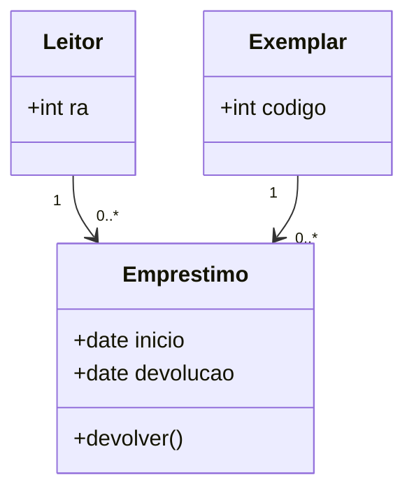

# Modelagem UML, entidades e documentação

Gilmar da Silva — 201269

Problema: uma biblioteca empresta um exemplar a um leitor; a devolução encerra o empréstimo. Primeiro escreva RF01 (emprestar), RF02 (devolver), ator, pré-condição, exceção e resultado esperado. Depois compare sua modelagem com o ponto de partida:

A cardinalidade registra o histórico, mas não impede dois empréstimos ativos do mesmo exemplar: isso exige regra adicional. Desenhe uma sequência leitor → interface → serviço → repositório para solicitar o empréstimo. Relacione cada mensagem a uma responsabilidade de classe.

**Entrega:** diagrama de classes, sequência, três critérios Dado/Quando/Então e tabela RF→teste. Execute `03_regras_estados.py` para comparar diagrama e tabela de transições. **Desafio:** adicione reserva e explique como ela muda o caso de uso sem confundir requisito com decisão de interface.
